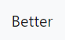
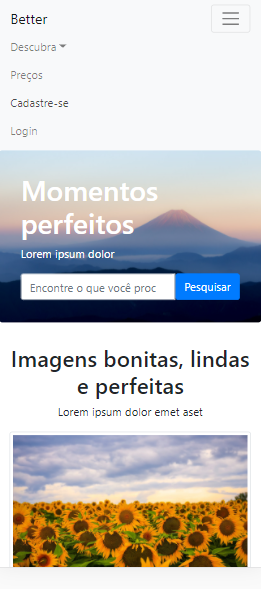
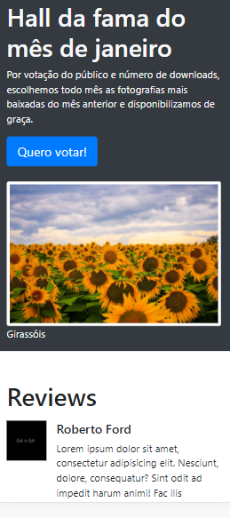
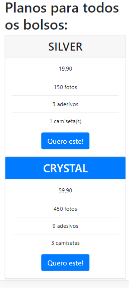
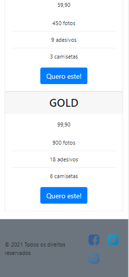
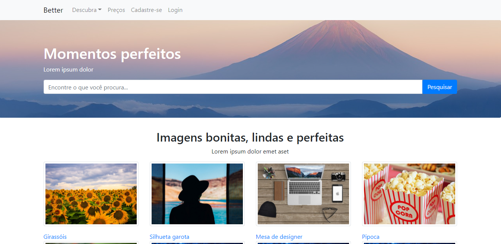
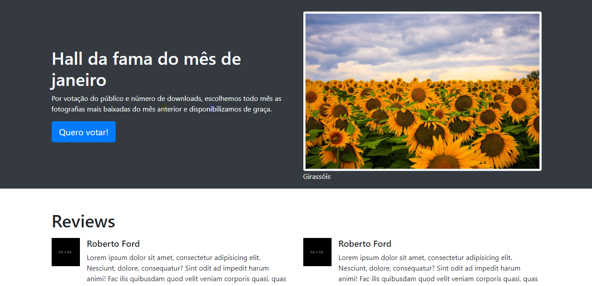
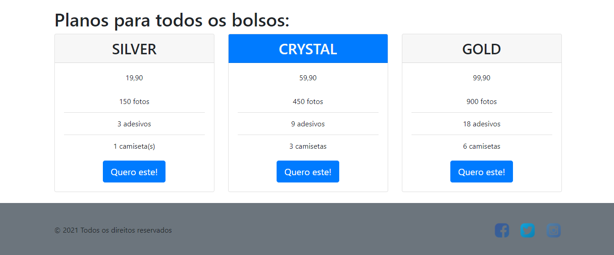

# Projeto Better - Banco de imagens

<br />
<p align="center">
  <a href="https://github.com/lucas-castro-developer/cc-projeto-better-bootstrap">
    
  </a>

  <h3 align="center">Projeto Better - Banco de imagens</h3>

  <p align="center">
    As melhores imagens no melhor estoque do capturas do mundo!
    <br />
    <a href="https://github.com/lucas-castro-developer/cc-projeto-better-bootstrap"><strong>Explore as documentações »</strong></a>
    <br />
    <br />
  </p>
</p>

<details open="open">
  <summary>Conteúdos</summary>
  <ol>
    <li>
      <a href="#sobre-o-projeto">Sobre o projeto</a>
      <ul>
        <li><a href="#construído-com">Construído com</a></li>
      </ul>
    </li>
    <li>
      <a href="#iniciando">Iniciando</a>
      <ul>
        <li><a href="#pré-requisitos">Pré-requisitos</a></li>
        <li><a href="#instalação">Instalação</a></li>
      </ul>
    </li>
    <li><a href="#Contribuição">Contribuição</a></li>
    <li><a href="#Licença">Licença</a></li>
    <li><a href="#Contato">Contato</a></li>
  </ol>
</details>

## Sobre o projeto

O projeto Better é um template de banco de imagens desenvolvido a partir das tecnologias HTML, CSS, Javascript e com a ajuda do framework Bootstrap para estilização.

A estrutura do trabalho visa entregar algo semântico e acessível e que consegue adaptar sua estrutura para os múltiplos tamanhos de tela.

Abaixo, segue imagens do layout construído em dispositivos  `mobile` e `desktop`:

**Mobile**









**Desktop**







### Construído com

Este projeto foi construído com o auxílio das seguintes ferramentas
* [HTML](https://developer.mozilla.org/pt-BR/docs/Web/HTML)
* [CSS](https://developer.mozilla.org/pt-BR/docs/Web/CSS)
* [Javascript](https://developer.mozilla.org/pt-BR/docs/Web/JavaScript)
* [Bootstrap](https://getbootstrap.com/)

<!-- GETTING STARTED -->
## Iniciando

Para começar a manipular o projeto, siga os passos abaixo:

### Pré-requisitos

O projeto não possui nenhum pré-requisito para funcionar.

### Instalação

### Instalação

1. Clone o repositório
 ```sh
 git clone https://github.com/lucas-castro-developer/cc-projeto-better-bootstrap.git
 ```

2. Instale as dependências
 ```sh
 npm install
 ```

3. A estrutura do projeto é bem simples e para ter acesso ao layout do template construído, é só abrir o arquivo index.html. 

Seu navegador de preferência será aberto e o template renderizado.

## Contribuição

Quer contribuir com este projeto? Então siga os passos abaixo:

1. Realize o fork do projeto
2. Crie sua branch (`git checkout -b feature/AmazingFeature`)
3. Faça o commit das suas modificações/criações (`git commit -m 'Add some AmazingFeature'`)
4. Publique a branch (`git push origin feature/AmazingFeature`)
5. Abra uma Pull Request

## Licença

Este projeto não utiliza nenhum tipo de licença.

## Contato

Lucas dos Santos Castro - [LinkedIn](https://www.linkedin.com/in/lucas-castro-5762a6125/) - lucascastrodeveloper@gmail.com

Project Link: [https://github.com/lucas-castro-developer/cc-projeto-better-bootstrap](https://github.com/lucas-castro-developer/cc-projeto-better-bootstrap)
